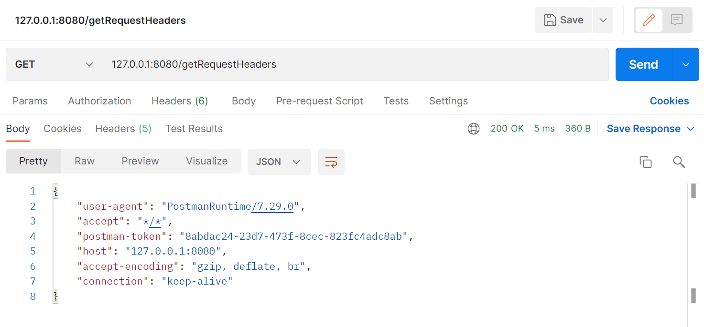
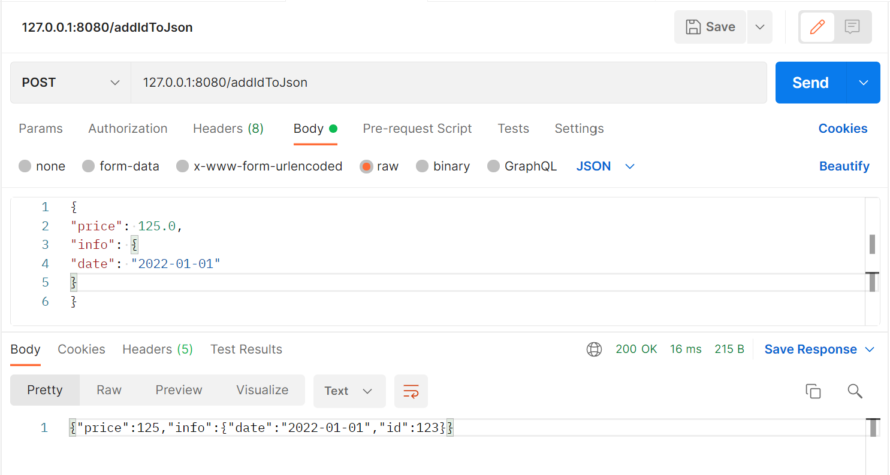
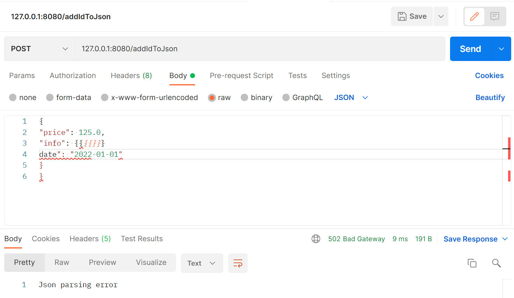

# Spring Boot web (hw 6)
## Демонстрация работы
`127.0.0.1:8080/getRequestHeaders`

`127.0.0.1:8080/addIdToJson`

Ловим exception, при сломанном json-е

## Запуск
Выполните следующие команды:
`mvn package`
`mvn spring-boot:run`